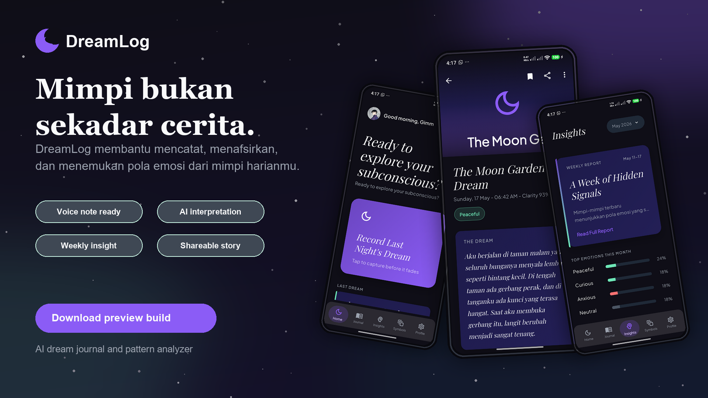

# DreamLog

<p align="center">
  
</p>

<p align="center">
  <strong>A tiny moonlit journal for dreams, symbols, and weekly self-reflection.</strong>
</p>

<p align="center">
  
  
  
</p>



DreamLog is a Flutter mobile app for fast dream capture, AI-powered interpretation, and weekly pattern analysis. It is built as an offline-first journal, so dreams stay saved locally with Hive while AI features can be enabled through a TokenRouter-compatible chat completions endpoint.

## What It Does

- Capture dreams with text input, dream date, and clarity level.
- Generate an interpretation with symbols, emotions, and a reflection question.
- Save interpreted dreams into a local journal.
- Browse, search, filter, bookmark, export, and inspect dream details.
- View mood patterns, recurring symbols, and weekly insights.
- Personalize the app with profile name, avatar, language, theme, reminder time, API key, and AI model.

## Tech Stack

- Flutter + Dart
- Riverpod for app state
- GoRouter with a persistent shell bottom navigation
- Hive for local offline storage
- Dio for AI API requests
- TokenRouter-compatible `/chat/completions`
- `speech_to_text`, `image_picker`, `pdf`, `flutter_local_notifications`, and `fl_chart`

## Run Locally

```bash
flutter pub get
flutter run
```

For live AI calls, either save the API key inside the app Settings screen or pass it at run time:

```bash
flutter run --dart-define=TOKENROUTER_API_KEY=your_key_here
```

No API key is committed to this repository. If no key is configured, DreamLog uses local fallback interpretations so the app can still be tested.

## Android Build

```bash
flutter analyze
flutter test
flutter build apk --debug
```

## Project Shape

```text
lib/
  core/        theme, tokens, router
  data/        models, repositories, services
  features/    splash, home, journal, entry, insights, symbols, profile
  shared/      providers and reusable widgets
```

## Creator

Built by Nvia (Gimm) for Gimora Digital as a dreamy Flutter portfolio project.
